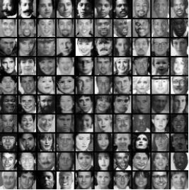
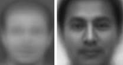
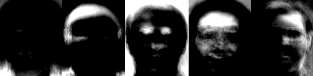

# pedestrian_recognition - Trabalho de Tópicos em Visão Computacional (Prof. David Menotti)

### 1. Implement codes to load the databases
   - ORL (AT&T) Database -- 10 subjects x 40 images, each one with 92x112 pixels and 256 grey levels
   - The Yale Face Database -- 15 subjects x 11 images, each one with 320 x 243 pixels
   
   
### 2. Implement a function to compute the mean face for both databases
   
### 3. Compute the first five eigenfaces for both databases
   
   
### 4. Implement the Eigenface and Fisherface method
### 5. Use a cross-validation scheme of leave-one-"expression or lighting" for the Yace Face Database.
### 6. Use a ten-fold cross-validation scheme and report the mean an stand deviation accuracies for the ORL database.
### 7. Provide a runtime analysis for training and testing
